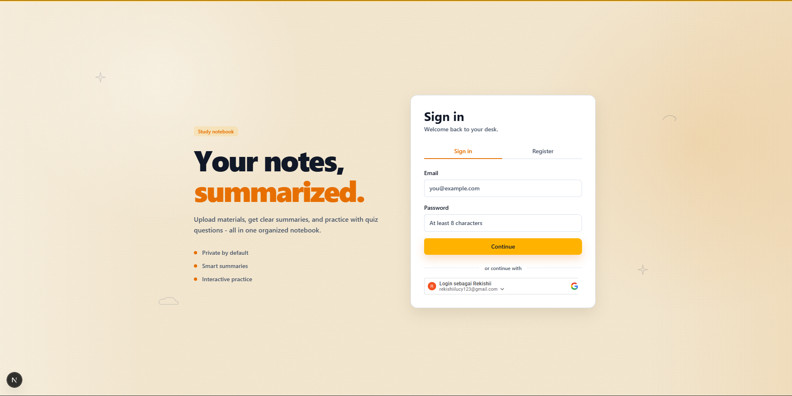
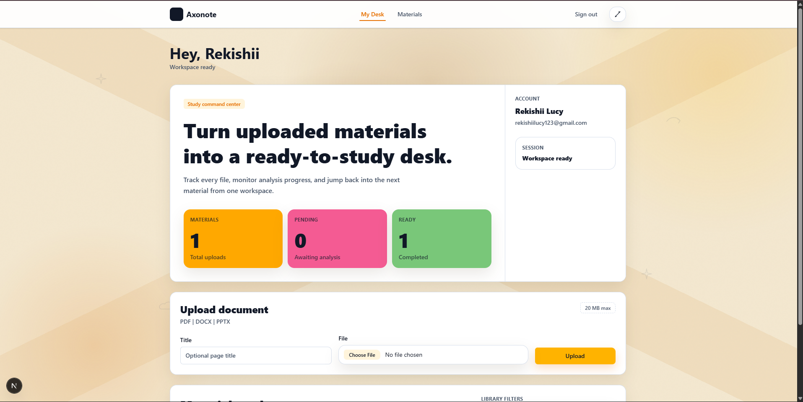
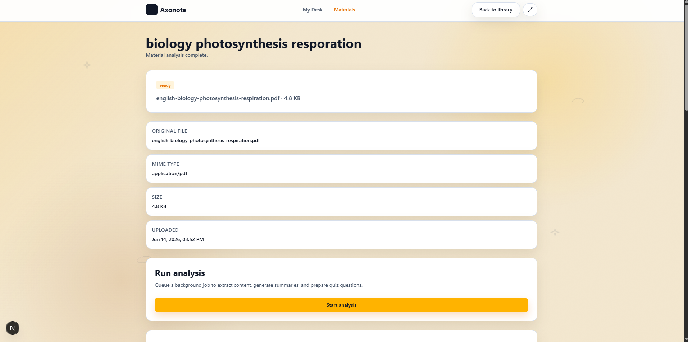
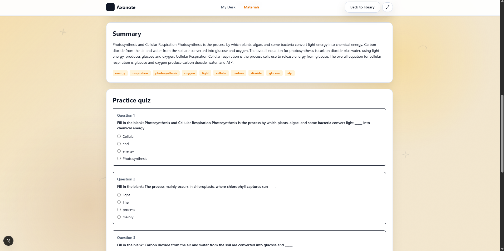

# Axonote

Axonote is a study notebook application that turns uploaded learning materials into readable summaries and practice quizzes. It is built as a monorepo with a Next.js web app, a FastAPI backend, a Python background worker, and MySQL.

The analysis pipeline uses classic ML/NLP techniques such as document parsing, TextRank-style summarization, keyword extraction, and rule-based question generation. It does not require an LLM service.

## Product Preview

### Authentication

Axonote supports email/password authentication and Google sign-in. The login experience is designed as a notebook-themed study desk entry point.



### Study Desk Dashboard

The dashboard gives students one workspace for upload activity, analysis progress, and quick access to their material library.



### Material Workspace

Each uploaded material has a workspace that tracks file metadata, analysis status, and the action used to queue background processing.



### Summary and Practice Quiz

After analysis completes, Axonote displays an extractive summary, keywords, and practice questions generated from the uploaded material.



## Core Features

- Private user accounts with JWT-based authentication.
- Google sign-in support through a configured OAuth client ID.
- Upload support for PDF, DOCX, and PPTX learning materials.
- Background material analysis handled by a worker process.
- Extractive summaries generated from document text.
- Keyword chips for quick topic scanning.
- Multiple-choice practice questions generated from the source material.
- Quiz attempt submission and attempt history.
- MySQL-backed persistence for users, materials, summaries, jobs, question sets, questions, and attempts.

## Architecture

```text
apps/web       Next.js App Router frontend
apps/api       FastAPI backend and REST API
apps/worker    Python worker for document analysis jobs
packages       Shared contracts and types, when needed
infra          Infrastructure and database configuration
docs           Project architecture, API, database, and security notes
```

Typical flow:

```text
User uploads material
        |
        v
FastAPI stores metadata and file
        |
        v
Analysis job is queued in MySQL
        |
        v
Worker extracts text, summary, keywords, and quiz questions
        |
        v
Frontend displays the study workspace
```

## Tech Stack

| Layer | Technology |
| --- | --- |
| Frontend | Next.js App Router, TypeScript, Tailwind CSS, shadcn/ui, TanStack Query |
| Backend | FastAPI, Pydantic, SQLAlchemy, Alembic, JWT auth |
| Worker | Python, scikit-learn, networkx/TextRank-style ranking, pypdf, python-docx, python-pptx |
| Database | MySQL 8.x |
| Testing | pytest, Ruff, Next.js linting and type checks |

## Repository Layout

```text
Axonote/
+-- apps/
|   +-- web/          # Next.js frontend
|   +-- api/          # FastAPI backend
|   +-- worker/       # Background analysis worker
+-- assets/           # README screenshots
+-- docs/             # Architecture, API, database, and security docs
+-- infra/            # Infrastructure configuration
+-- packages/         # Shared contracts and types
+-- samples/          # Sample files for local testing
+-- scripts/          # Local development helper scripts
```

## Prerequisites

- Node.js and npm.
- Python 3.10 or newer.
- MySQL 8.x. For local development, XAMPP MySQL on `localhost:3306` is supported.
- A local database named `axonote`.

## Environment Files

Create local environment files from the examples:

```powershell
Copy-Item apps/api/.env.example apps/api/.env
Copy-Item apps/web/.env.example apps/web/.env.local
```

Example API environment:

```env
DATABASE_URL=mysql+pymysql://root:@localhost:3306/axonote
UPLOAD_DIR=./uploads
JWT_SECRET=change-me-in-production
CORS_ORIGINS=http://localhost:3000
ACCESS_TOKEN_EXPIRE_MINUTES=15
GOOGLE_CLIENT_ID=your-google-client-id.apps.googleusercontent.com
```

Example web environment:

```env
NEXT_PUBLIC_API_BASE_URL=http://localhost:8000/api/v1
NEXT_PUBLIC_GOOGLE_CLIENT_ID=your-google-client-id.apps.googleusercontent.com
```

Never commit real `.env` or `.env.local` files. Keep real secrets and OAuth client IDs in local environment files only.

## Local Setup

Install frontend dependencies from the repository root:

```powershell
npm ci
```

Install backend dependencies:

```powershell
python -m pip install -r apps/api/requirements.txt
```

Install worker dependencies:

```powershell
python -m pip install -r apps/worker/requirements.txt
```

Prepare or reset the local development database:

```powershell
powershell -ExecutionPolicy Bypass -File scripts/reset-dev-db.ps1
```

The reset script recreates the local `axonote` database. Use it only for development data that can be removed.

## Running the App

Run the API:

```powershell
cd apps/api
$env:PYTHONPATH='.'
python -m uvicorn app.main:app --reload --host 127.0.0.1 --port 8000
```

Run the worker in another terminal:

```powershell
cd apps/worker
$env:PYTHONPATH='.'
python -m worker.main
```

Run the web app from the repository root:

```powershell
npm run dev:web
```

Open the web app at:

```text
http://localhost:3000
```

API documentation is available while the backend is running:

```text
http://127.0.0.1:8000/docs
```

## API Overview

The backend exposes versioned routes under `/api/v1`.

| Area | Endpoints |
| --- | --- |
| Auth | `/auth/register`, `/auth/login`, `/auth/google`, `/auth/refresh`, `/auth/logout`, `/auth/me` |
| Materials | `/materials`, `/materials/{id}`, `/materials/{id}/analyze`, `/materials/{id}/latest-job`, `/materials/{id}/summary` |
| Jobs | `/jobs/{id}` |
| Questions | `/materials/{id}/question-set` |
| Quiz Attempts | `/materials/{id}/attempts`, `/materials/{id}/attempts/history` |

See `docs/api-contract.md` for the detailed API contract.

## Development Checks

Run frontend checks:

```powershell
npm run lint:web
npm run typecheck
npm run build:web
```

Run API checks:

```powershell
cd apps/api
$env:PYTHONPATH='.'
ruff check .
pytest
```

Run worker checks:

```powershell
cd apps/worker
$env:PYTHONPATH='.'
ruff check .
pytest
```

## Security Notes

- Uploaded files are limited to supported learning document formats.
- Authentication uses JWT access tokens and refresh tokens.
- Protected resources must be checked against the authenticated user on the backend.
- Generated quiz questions must not expose `correct_index` or explanations before an attempt is submitted.
- CORS should only allow trusted frontend origins outside local development.
- Secrets, credentials, uploaded files, caches, and local environment files must remain ignored by Git.

See `docs/security-policy.md` for the complete security policy.

## Sample Files

Use files in the `samples/` directory to test upload, analysis, summary generation, and quiz generation in a local development environment.

## Troubleshooting

### The web app says it cannot reach the API

Check that the API is running on `127.0.0.1:8000` and that `apps/web/.env.local` points to:

```env
NEXT_PUBLIC_API_BASE_URL=http://localhost:8000/api/v1
```

### Uvicorn cannot import `main`

Run the backend with the package path:

```powershell
cd apps/api
$env:PYTHONPATH='.'
python -m uvicorn app.main:app --reload --host 127.0.0.1 --port 8000
```

### Google sign-in fails

Confirm that the same Google OAuth client ID is configured in:

```text
apps/api/.env
apps/web/.env.local
```

Also confirm that the backend is running and that the Google OAuth client allows the local development origin.

## Project Documentation

- `docs/architecture.md`
- `docs/api-contract.md`
- `docs/database-design.md`
- `docs/security-policy.md`
- `docs/contributing.md`
